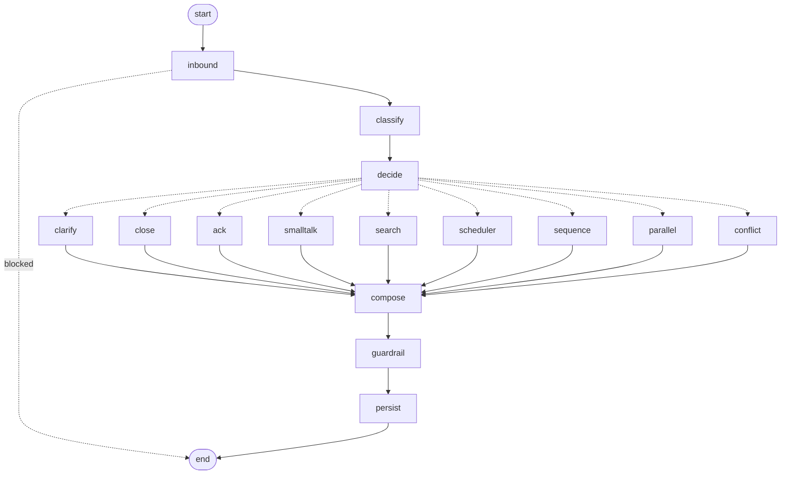

# How the system works

Three questions, answered against the code:

1. [How one visitor message becomes a reply](#1-one-message-end-to-end), step by step.
2. [How work passes between agents, and how failures come back](#2-agent-handoffs-and-failures).
3. [How many visitors are served at once, each with a separate session](#3-many-visitors-at-once).

Design choices and their justification are in [DECISIONS.md](DECISIONS.md).

---

## 1. One message, end to end

Example: a visitor types **"How long does an MVP take, and can I book a call this week?"**

```
Browser widget
  │  POST /api/chat {visitor_key, message, visitor_tz}
  ▼
FastAPI  app/main.py: chat()
  │
  ▼
Orchestrator.handle()                                   app/agents/orchestrator.py
  ├─ 1  find or create the session for visitor_key      store.get_or_create_by_visitor_key
  ├─ 2  new trace_id; bind trace_id + session_id        llm.bind_trace (every LLM call below is tagged)
  ├─ 3  take the session lease                          store.session_lock   (one turn per session)
  │
  └─ _turn()  ->  LangGraph turn_graph.ainvoke()       app/agents/graph.py  (graph node in [brackets])
      ├─ 4  inbound guardrail             [inbound]     guardrail.check_inbound  -> block? reply + END
      ├─ 5  save visitor message (append-only)          store.append_message
      ├─ 6  classify intents + signals    [classify]    LLM "orchestrator.classify"
      ├─ 7  route                         [decide]      decide_route() -> conditional edge
      │       search + schedule  ->  route "sequence"   [sequence]:
      │         ├─ Search agent      rewrite (LLM) -> pgvector match_chunks -> grounded answer (LLM)
      │         └─ Scheduler agent   tool loop (LLM) -> call_tool guard -> MCP propose_slots
      │                                                  -> calendar server -> Google freebusy
      ├─ 8  failed sub-agent? substitute its fallback text, record agent_errors   [compose]
      ├─ 9  compose draft = Search answer + Scheduler reply                        [compose]
      ├─ 10 outbound guardrail            [guardrail]   guardrail.check_outbound -> block? safe fallback
      ├─ 11 save assistant message        [persist]     store.append_message
      ├─ 12 apply state patches (optimistic lock)       store.update_with_retry(build_patch)
      ├─ 13 log routing_decision (reason, policy, intents, graph_path, agent_errors)
      └─ 14 visitor said goodbye? -> Lead-Summary agent (lease already held)
  │
  ▼  release lease
{reply, slots, session_id, trace_id}  ->  widget renders the answer and clickable slot buttons
```

The turn itself (steps 4-14) is a **LangGraph `StateGraph`**. Its routing policy is the set of
conditional edges out of `decide`:



Each node is one of the Orchestrator's step functions, and every turn logs the path it took
(`graph_path`). Session state stays in Supabase rather than a LangGraph checkpointer; DECISIONS.md,
decision 13 explains why. `ORCHESTRATOR_ENGINE=native` runs the same steps without LangGraph.

What happens at each step, and why:

| # | Step | Detail |
|---|---|---|
| 1 | Session lookup | `visitor_key` is a random UUID the widget keeps in `localStorage`. The store returns the visitor's one live session (`active` or `booked`, not expired) or creates it. A unique index guarantees one live session per visitor. |
| 2 | Trace binding | A fresh `trace_id` identifies this turn. It is stored in a context variable, so every log row and every Langfuse generation below carries it without being passed through each function. |
| 3 | Lease | A second message from the same visitor waits here until this turn finishes (see section 3). |
| 4 | Inbound guardrail | Regex patterns first (free), then an LLM check. A blocked message gets a safe reply; nothing else runs. Fails *open* if the classifier is down. |
| 5 | Save message | `messages` is append-only. State is re-read so the classifier sees the full history. |
| 6 | Classify | One strict-JSON call returns ranked intents with confidences, plus any name, email, budget or timeline the visitor stated. |
| 7 | Route | Deterministic code, not the LLM: below 0.60 confidence -> clarifying question; question + booking -> `sequence`; two questions -> `parallel` (`asyncio.gather`); conflicting booking intents -> `clarify`. The chosen policy and its reason are logged. |
| 7a | Search | Rewrites the question into a standalone query, embeds it, retrieves top-6 chunks above 0.35 similarity, answers only from them, and returns citations plus `confidence = 0.6*similarity + 0.4*groundedness`. With no hits it declines instead of guessing. |
| 7b | Scheduler | The model decides the action; `call_tool` checks and fills the arguments (DECISIONS.md, decision 14), then calls the calendar MCP server over authenticated HTTP. The server re-checks the booking rules and availability. Slots offered are saved as a state patch, so the next turn can only book one of them. |
| 8 | Failure check | See section 2. |
| 10 | Outbound guardrail | Checks the draft against the **verified facts** the agents return - the text of the passages Search used, and the calendar tool's own output (offered slots, booking results) from the Scheduler - for invented facts, unauthorised commitments, leaked internals and third-party emails. Fails *closed*: if it can't verify the draft, a safe fallback is sent instead. |
| 12 | State write | The Orchestrator is the only writer. It merges each agent's `state_patch` (booking, proposed slots, qualification) inside `build_patch(fresh)`, which is re-run on fresh state if a version conflict occurs. |
| 14 | Lead summary | On goodbye, or later from the idle sweeper, the Lead-Summary agent builds the summary, scores it deterministically, and decides through a tool call to send, update or skip the sales email. |

Where to see it: `/session/{id}` shows the transcript plus every log row for the session in order
(`routing_decision`, `guardrail_check`, `tool_call`, `llm_call`, `retry`, `fallback`). In Langfuse,
the same `trace_id` shows each model call with its prompt, response, tokens and cost.

---

## 2. Agent handoffs and failures

### The handoff contract

Every sub-agent is an async function with the same signature (`app/contracts.py`):

```
run(AgentRequest) -> AgentResponse

AgentRequest   session_id, trace_id, message, state (read-only SessionState snapshot), params
AgentResponse  status "ok" | "error", agent, output {reply, slots, ...}, confidence, citations,
               state_patch {changes the agent wants saved}, error: AgentError | None
AgentError     error_code, message, retryable, agent          (the exact FR-8.3 shape)
```

Rules that make handoffs predictable:

- **Work flows down, results flow up.** Only the Orchestrator calls sub-agents; sub-agents never call
  each other. In `sequence`, Search's answer and the Scheduler's reply are combined by the
  Orchestrator, not passed agent to agent.
- **Sub-agents never write state.** They return a `state_patch`; the Orchestrator applies all patches
  in one optimistic-locked write. A failed agent's partial work therefore can't corrupt the session.
- **Context goes down in the request.** Each agent gets the same state snapshot (history,
  qualification, booking, proposed slots) plus agent-specific `params`, e.g. `{"complete": false}`
  for an abandoned-session lead summary.

### How a failure travels back to the Orchestrator

Failures are caught at the lowest level that can handle them, and are always reported upward as data,
never as an exception that breaks the turn:

```
Google / Resend / OpenAI                 HTTP error or timeout
        │
MCP server                               catches it, returns {"status":"error", error_code, retryable}
        │
MCPHub.call  (app/mcp_client.py)         with_retry: retryable -> 3 attempts, 1s/2s/4s + jitter
        │                                non-retryable (401, SLOT_TAKEN, OUTSIDE_BUSINESS_HOURS...) -> 0 retries
        │                                gives up -> raises ToolFailure(AgentError)
        │
Sub-agent                                (a) recoverable -> returned to the model as a tool result
        │                                    e.g. SLOT_TAKEN -> the model proposes new slots
        │                                (b) unrecoverable -> planned fallback, AgentResponse with .error
        │                                    e.g. calendar down -> "leave your email, Baskaran confirms"
        │                                    e.g. email down -> lead queued in email_outbox
        │                                (c) anything else -> err(agent, CODE, msg, retryable)
        │
Orchestrator._call_agent                 safety net: an exception that escaped the agent
        │                                becomes err(agent, "<AGENT>_CRASHED", ...)
        │
Orchestrator._turn step 8                every r.error is collected into decision["agent_errors"]
                                         status "error" with no reply -> AGENT_FALLBACKS[agent] text
                                         the other agents' results are still used
```

Concrete cases:

| Failure | Retries | What the visitor sees | What is logged |
|---|---|---|---|
| Calendar 503 (outage) | 3, then give up | "I couldn't reach our calendar... leave your name and email" | `retry` x3, `fallback`, `agent_errors` in routing_decision |
| Calendar 401 (bad credentials) | 0 | same fallback | `retry` with `retryable: false`, `fallback` |
| Slot taken between offer and booking | 0 | new slots offered in the same reply | `tool_call` with the error |
| Model picks a slot never offered | never sent to the server | the model offers valid slots | `tool_call` with `rejected_by_policy` |
| Search crashes (e.g. database down) | - | "I couldn't look that up just now..." | `error`, `agent_errors` |
| In `sequence`, Search fails, Scheduler works | - | Search's fallback line + real slots | `agent_errors` for search only |
| Resend down at lead time | 3, then queue | nothing (visitor is gone) | `fallback: queued_for_retry`; drained every 2 min |
| Model call hangs (provider overloaded) | 30 s timeout per call, then 3 attempts with backoff | the agent's fallback reply | `retry`, `fallback` |
| Whole turn throws | - | honest "please send that again" reply, **also saved to the session** so a reload never shows an unanswered message (FR-8.4) | `error` with the traceback (`Orchestrator._turn_failed`) |

---

## 3. Many visitors at once

### Isolation: one session per visitor

- **Identity.** The widget creates a random `visitor_key` (UUID) once and keeps it in `localStorage`,
  so reloads and new tabs in the same browser reuse it, while every other browser has its own.
- **One row per conversation.** `sessions` holds one row per conversation, found by `visitor_key`. A
  partial unique index allows only one live (`active`/`booked`) session per key, and creation uses
  `insert ... on conflict do nothing`, so two tabs racing on their first message converge on one row.
- **Everything else is keyed by `session_id`.** Messages, logs, the email outbox row and the Langfuse
  session all hang off the session id. **The database enforces this, not just the code**: the app
  connects as a restricted role (`closefuture_app`) under row-level security, and every query first
  sets `app.visitor_key` / `app.session_id` for the connection (`Store._scoped`). The RLS policies only
  return or accept rows for that visitor/session, so even a bug in a query cannot read or write another
  visitor's data. Only the background jobs that must scan all sessions (idle sweep, expiry, email-queue
  drain) use a separate admin connection. Every query also filters by session id, so one visitor's turn can never read
  another visitor's history. The outbound guardrail additionally blocks any email address the current
  visitor didn't type.
- **Coming back.** `/api/history?visitor_key=...` returns the live session's messages, and the widget
  redraws them on open. After 30 days of inactivity (sliding: every turn pushes `expires_at` forward)
  the session expires and the next visit starts fresh.

### Concurrency: different visitors in parallel, one visitor in order

```
visitor A  ──turn──►  lease(A) ──► agents ──► release(A)
visitor B  ──turn──►  lease(B) ──► agents ──► release(B)          A and B run fully in parallel
visitor A  ──2nd msg─► waits for lease(A) ... then runs on A's updated state
```

- **Across visitors there is no shared lock.** FastAPI runs each request as an asyncio task. Nearly all
  of a turn's time is spent awaiting I/O (OpenAI, pgvector, MCP), so one process interleaves many
  visitors' turns. The only shared resources are the database pool (10 connections, each held only
  for a single query, never across an LLM call) and API rate limits, which the retry policy absorbs.
- **Within one visitor, turns are serialised** by the session lease (a row-level lock with a 60 s
  expiry, renewed by a heartbeat). This is what stops two quick messages from interleaving - for
  example both trying to book, or one overwriting the other's state.
- **Scaling out.** Because the lease and all state live in Postgres rather than in process memory,
  you can run several API workers or containers behind a load balancer: any worker can serve any
  visitor's next turn. The sweeper takes the same lease without waiting (`wait_s=0`), so it never
  interrupts a visitor mid-turn; a busy session is simply picked up on the next sweep.
- **Background work is per session too.** The idle sweeper finds sessions quiet for
  `SESSION_IDLE_TIMEOUT_MIN` with no summary sent, and runs the Lead-Summary agent for each one under
  that session's lease. The unique outbox row per session keeps its email exactly-once, even if two
  workers' sweepers overlap.
